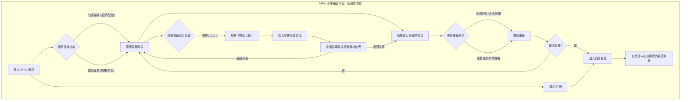

# SA.md - 系統分析 (System Analysis)

## 1. 系統流程圖 

此圖描述了使用者與系統互動時，資料如何在不同功能模組之間流動。

```mermaid
graph TD
    subgraph "Mfive 新車鑑賞平台 - 使用者流程"
        A[進入 Mfive 首頁] --> B{使用搜尋功能};
        B -- 快速搜尋 (品牌/型號) --> C[瀏覽車輛列表];
        B -- 進階篩選 (價格/車型) --> C;

        C --> D[點擊進入車輛詳情頁];
        C --> K{勾選車輛進行比較};
        
        K -- 選擇2台以上 --> L[點擊「開始比較」];
        L --> M[進入並排比較頁面];
        M --> N[查看各車款規格與價格差異];
        N -- 返回列表 --> C;
        N -- 返回詳情 --> D;
        
        D --> E{查看車輛資訊};
        E -- 查看照片/規格/配備 --> F[鑑賞車輛];
        E -- 查看全新參考價格 --> F;

        F --> G{是否收藏?};
        G -- 是 --> H[加入我的最愛];
        G -- 否 --> C;

        H --> I[在會員中心查看我的最愛列表];
        A --> J[登入/註冊];
        J --> H;
   end
```