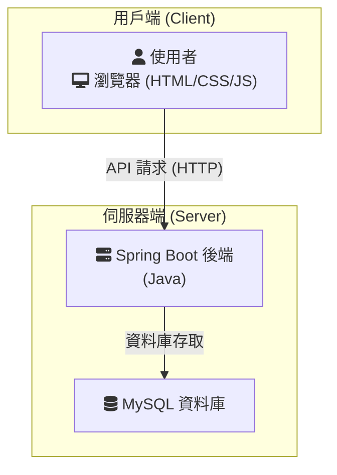

### Mfive 賞車網 - 系統架構圖 (視覺化版)

這是一個簡單的前後端分離設計，適合初學者學習與開發。

### 架構說明

1.  **用戶端 (Client-Side)**:
    *   **技術**: 使用標準的 `HTML`, `CSS`, 和 `JavaScript` 來建構使用者介面。
    *   **職責**: 負責顯示頁面、與使用者互動，並透過 API (HTTP/JSON) 向後端請求資料或提交操作。
    *   **優點**: 前後端完全分離，開發分工明確，且前端可以獨立部署。

2.  **伺服器端 (Server-Side)**:
    *   **後端應用程式**: 使用 `Spring Boot` 框架，以 `Java` 語言開發。
    *   **職責**: 提供 API 接口給前端呼叫、處理業務邏輯 (如：查詢車輛資料、使用者驗證等)、並存取資料庫。
    *   **資料庫**: 選擇 `MySQL` 作為資料庫，用於儲存所有應用程式資料 (如：車輛資訊、使用者資料等)。

這個架構移除了原有的 `Thymeleaf` (伺服器端渲染)、`Spring Security` (可後續再加入)、以及 `JPA/Hibernate` 的複雜層，直接定義為 Spring Boot + MySQL，讓整體結構更清晰、更容易理解。
