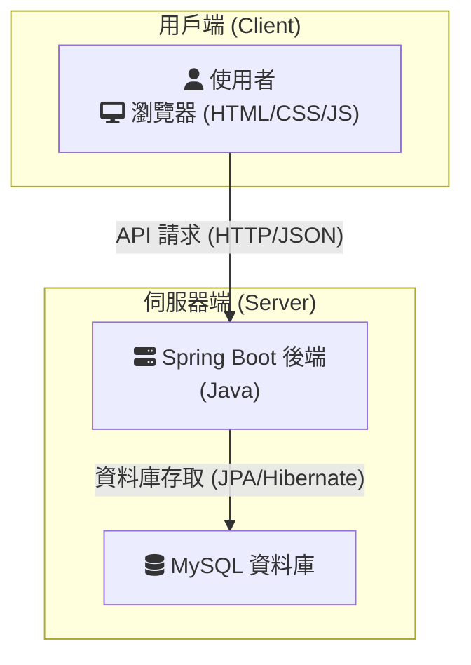
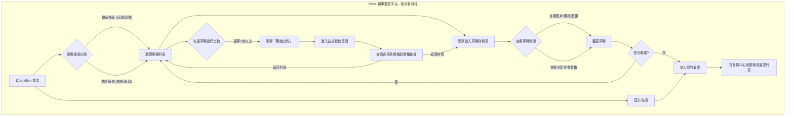

# 設計文件：MFIVE 賞車網系統設計

本文件整合了專案的系統架構與核心使用者流程，作為規格實現的技術與業務藍圖。

---

### 1. 系統架構圖

本專案採用前後端分離的設計，以實現開發分工、獨立部署與更好的擴展性。

**架構說明**:

*   **用戶端 (Client-Side)**:
    *   **技術**: 標準 `HTML`, `CSS`, `JavaScript`。
    *   **職責**: 負責UI渲染、使用者互動，並透過 RESTful API 與後端進行資料交換。

*   **伺服器端 (Server-Side)**:
    *   **後端應用程式**: 使用 `Spring Boot` 框架開發，提供 API 接口並處理所有業務邏輯。
    *   **資料庫**: 使用 `MySQL` 儲存所有應用程式資料，包含使用者、車輛、評論等。

---

### 2. 核心使用者流程

此流程圖描述了使用者從進入網站到完成核心目標（如比較車輛、收藏車輛）的完整路徑。

