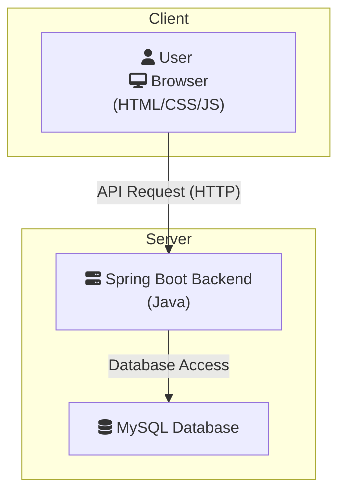

# MFIVE Car Showcase - Consolidated Architecture Document
# MFIVE 賞車網 - 綜合架構文件

This document provides a comprehensive overview of the MFIVE project, consolidating its requirements, system architecture, and user flows.
本文件提供了 MFIVE 專案的全面概述，整合了其需求、系統架構和使用者流程。

---

## 1. Project Vision & Goal
## 1. 專案願景與目標

**English:** To address the current fragmentation of online car information and the difficulty in comparing specifications, we aim to build a centralized, user-friendly online car showcase platform, "MFIVE Car Showcase." The core objective is to provide a convenient and fast channel for potential car buyers and enthusiasts to easily search, compare, and obtain the latest and most complete vehicle information, thereby optimizing their decision-making process and enhancing the car viewing experience.

**繁體中文:** 為了解決目前線上汽車資訊零散、規格比較不易的痛點，我們旨在建立一個集中化、使用者體驗友善的線上賞車平台——「MFIVE賞車網」。本專案的核心目標是提供一個方便、快速的管道，讓潛在購車者與汽車愛好者能輕鬆搜尋、比較並獲取最新、最完整的車輛資訊，從而優化他們的決策流程並提升賞車體驗。

---

## 2. Target Audience
## 2. 目標使用者

**English:**
*   **Primary Users:**
    *   **Potential Car Buyers:** Consumers actively researching and comparing for their next new car purchase.
    *   **First-Time Buyers:** Younger demographics or families unfamiliar with the car market who need detailed guidance and clear specification comparisons.
*   **Secondary Users:**
    *   **Car Enthusiasts:** A community passionate about tracking specific brands or the latest models and enjoying the exploration of automotive craftsmanship and design.
    *   **Car Sales Consultants:** Professionals who need a quick platform to understand market dynamics and competitor information.

**繁體中文:**
*   **主要使用者:**
    *   **潛在購車者:** 正在積極為購買下一輛新車進行研究和比對的消費者。
    *   **首次購車者:** 對汽車市場不熟悉，需要詳細引導和清晰規格比較的年輕族群或家庭。
*   **次要使用者:**
    *   **汽車愛好者:** 熱衷於追蹤特定品牌或最新車款，並享受探索汽車工藝與設計的社群。
    *   **汽車銷售顧問:** 需要一個快速了解市場動態與競品資訊的平台。

---

## 3. Key Features
## 3. 核心功能

**English:**
*   **Smart Search:** Quickly filter vehicles that meet requirements through multiple criteria such as brand, model, price range, and body type (e.g., SUV, sedan).
*   **Detailed Vehicle Information:** View official specifications, equipment, image galleries, and the crucial "new reference price" for each car.
*   **Cross-Model Comparison:** Add multiple interested vehicles to a comparison list for a side-by-side comparison of specifications and prices on a dedicated page, with differences highlighted.
*   **Personalized Favorites:** Registered members can save their favorite models to "My Favorites" for easy viewing and tracking in the future.

**繁體中文:**
*   **智慧搜尋:** 透過品牌、型號、價格區間、車身類型（如 SUV、轎車）等多重條件，快速篩選出符合需求的車輛。
*   **詳細車輛資訊:** 查看每輛車的官方規格、配備、圖集，以及最重要的「全新參考售價」。
*   **跨車款比較:** 將多款感興趣的車輛加入比較清單，在專屬頁面進行並排的規格與價格比較，差異點一目了然。
*   **個人化收藏:** 註冊會員後，可將喜愛的車款儲存至「我的最愛」，方便未來隨時查看與追蹤。

---

## 4. System Architecture
## 4. 系統架構

**English:** The system uses a simple front-end/back-end separated design, suitable for learning and development.

**繁體中文:** 這是一個簡單的前後端分離設計，適合初學者學習與開發。



**Architecture Description (架構說明):**

1.  **Client-Side (用戶端):**
    *   **Technology (技術):** Standard `HTML`, `CSS`, and `JavaScript` are used to build the user interface.
    *   **Responsibilities (職責):** Responsible for displaying pages, interacting with the user, and requesting data or submitting actions to the backend via API (HTTP/JSON).
    *   **Advantages (優點):** Complete separation of front-end and back-end, clear division of labor, and the front-end can be deployed independently.

2.  **Server-Side (伺服器端):**
    *   **Backend Application (後端應用程式):** Developed using the `Spring Boot` framework with the `Java` language.
    *   **Responsibilities (職責):** Provides API endpoints for the front-end, handles business logic (e.g., querying vehicle data, user authentication), and accesses the database.
    *   **Database (資料庫):** `MySQL` is chosen as the database to store all application data (e.g., vehicle information, user data).

---

## 5. User Flow
## 5. 使用者流程

**English:** This diagram describes how data flows between different functional modules when a user interacts with the system.

**繁體中文:** 此圖描述了使用者與系統互動時，資料如何在不同功能模組之間流動。

```mermaid
graph TD
    subgraph "Mfive New Car Showcase - User Flow"
        A[Enter Mfive Homepage] --> B{Use Search Function};
        B -- Quick Search (Brand/Model) --> C[Browse Vehicle List];
        B -- Advanced Filter (Price/Type) --> C;

        C --> D[Click to Vehicle Details Page];
        C --> K{Select Vehicles for Comparison};
        
        K -- Select 2+ cars --> L[Click "Start Comparison"];
        L --> M[Enter Side-by-Side Comparison Page];
        M --> N[View Spec & Price Differences];
        N -- Return to List --> C;
        N -- Return to Details --> D;
        
        D --> E{View Vehicle Information};
        E -- View Photos/Specs/Equipment --> F[Appreciate Vehicle];
        E -- View New Reference Price --> F;

        F --> G{Add to Favorites?};
        G -- Yes --> H[Add to My Favorites];
        G -- No --> C;

        H --> I[View My Favorites in Member Center];
        A --> J[Login/Register];
        J --> H;
   end
```

---

## 6. Out of Scope
## 6. 專案範圍外

**English:** To ensure focus on core features in the initial phase, the following items are **not** included in the first development phase:
*   **Online Transactions:** No payment gateway integration, online contracting, or car sales functions.
*   **User-Generated Content:** No community forums, user reviews, or rating systems initially.
*   **Auto Finance & Insurance:** No direct provision of loan or insurance plans.
*   **Auto Parts & Accessories Sales:** No e-commerce for any car-related merchandise.

**繁體中文:** 為確保專案初期能聚焦核心功能，以下項目將**不**包含在第一階段的開發範圍內：
*   **線上直接交易:** 不提供任何金流串接、線上簽約或汽車買賣功能。
*   **使用者內容生成:** 初期不建立車主社群論壇、使用者評論與評分系統。
*   **汽車金融與保險:** 不直接提供貸款或保險方案。
*   **汽車零件與配件銷售:** 不涉及任何汽車周邊商品的電子商務。
